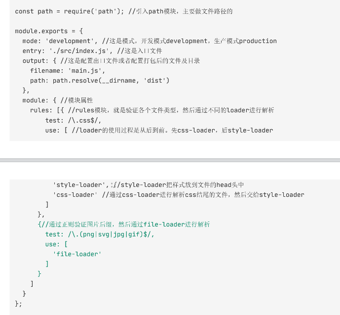
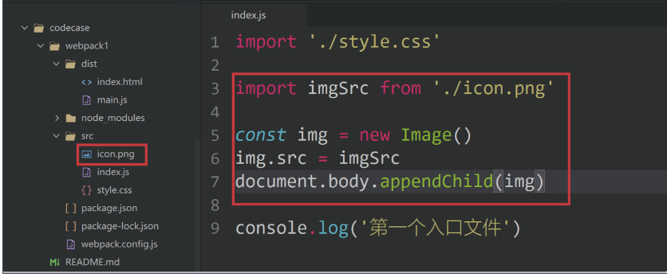
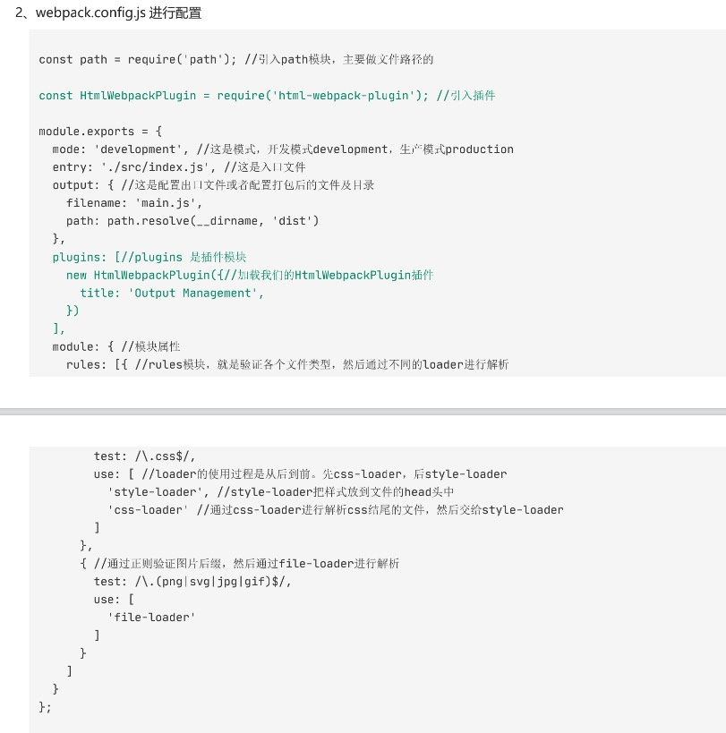
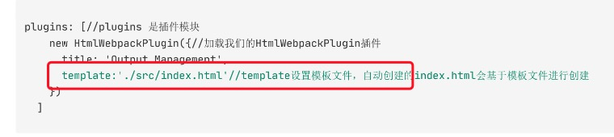
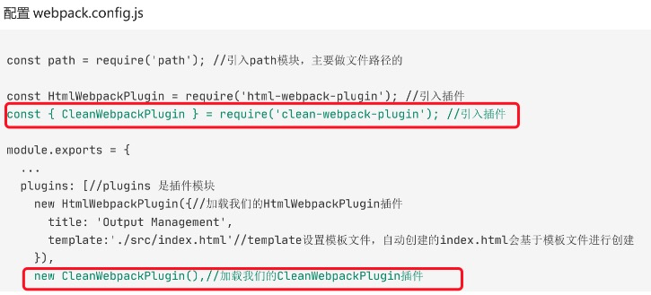

### 使用webpack搭建项目

### 一、简单打一个包吧

1、初始化包管理器

命令：npm init

2、安装webpack

本地安装：

npm i webpack -D

npm i webpack-cli -D

全局安装

npm i -g webpack webpack-cli

打包模式

在package.json下添加script

`“script”：{

​           "dev":"webpack —mode development",   //开发环境

​            "build":"webpack —mode production"  //生产环境

}

注意：创建文件夹必须要有默认的入口和出口文件

### 二、webpack核心属性入口和出口

#### 1、entry入口

##### 单文件入口

例如：entry："./src/index.js"

##### 多文件

想要多个依赖文件一起注入，并且将它们的依赖导向到一个"chunk"时，可传入数组的方式

##### 多入口

entry:{

​      pageOne:'./public/pageOne/index.js',

​      pageTwo:'./public/pageTwo/index.js'

​      pageThree:'./public/pageThree/index.js'

}

#### 2、出口output

##### 单出口

output:{

​       path:path.resolve(__dirname,'build'),

​       filename:'bundle.js' //出口文件起别名

}

##### 多出口

output:{

​        path:path.resolve(__dirname,'build'),

​        filename:'[name].js'

} 

### 三、webpack-dev-server

#### 1、什么是webpack-dev-server？

是webpack官方提供的一个小型express服务器，可以为webpack生成的资源提供web服务

##### （1）live reload

只要检测到代码改动就会自动重新构建，然后触发网页刷新

##### （2）webapack中的模块热替换

可以让代码在页面不刷新的前提下得到最新的改动，甚至不需要重新发起请求就能看到更新后的效果。

#### 2、安装webpack-dev-sever

npm i webpack-dev-server -D

#### 3、配置webpack.config.js文件

devServer:{

​      static:'./dist'，//设置服务器访问基本目录

​      host：'localhost',//服务器的ip地址

​      port：8080，//端口   

​      open：true//自动打开界面

 }

#### 4、配置package.json

"script":{

​       'start':'webpack-dev-server —mode development'

}

#### 5、最后运行文件

在build文件夹下创建index.html,在html中引入出口文件

### 四、webpack loader

##### 1、了解loader

loader让 webpack 能够去处理那些非 JavaScript 文件（webpack 自身只理解 JavaScript）。loader 可

以将所有类型的文件转换为 webpack 能够处理的有效模块，然后你就可以利用 webpack 的打包能

力，对它们进行处理。

##### 2、安装loader（打包css的loader）

安装style-loader和css-loader

npm install style-loader css-loader --save-dev

##### 3、webpack.config.js文件里配置module中的rules

在webpack的配置中loader有两个目标

1. test 属性，用于标识出应该被对应的 loader 进行转换的某个或某些文件。
2. use 属性，表示进行转换时，应该使用哪个 loader。

 `module:{`

​        `rules:[{`

​            `test:/\.css$/,`

​            `use:['style-loader','css-loader']`

​        `}]`

​    `},`

创建index.css文件并import进index.js文件中（注意：这么写只有webpack5不报错）

##### 4、webpack如何编译less和sass文件

##### 安装loader

下载：npm install less-loader less --save-dev

##### 配置loader

代码：

`module:{`

​        `rules:[{`

​            `test:/\.less$/,`

​            `use:['style-loader','css-loader','less-loader']`

​        `}]`

​    `},`

##### 5、babel-loader

下载：npm install -D babel-loader @babel/core @babel/preset-env

babel-loader：在webpack里应用 babel 解析ES6的桥梁

@babel/core：babel核心模块

@babel/preset-env：babel预设，内置一组 babel 插件的集合

module: {
  rules: [

    {
      test: /\.js$/,
      exclude: /(node_modules|bower_components)/,
      use: {
        loader: 'babel-loader',
        options: {
          presets: ['@babel/preset-env']
        }
      }
    }
  ]
}

6. ##### file-loader

让当前项目打包图片。

（1）需要安装：npm install --save-dev file-loader

（2）

webpack.config.js进行配置

...

#### 五、Webpack plugins

##### 1、html-webpack-plugin

（1）安装npm install --save-dev html-webpack-plugin 

（2）

index.html 文件自动生成。但是之前里面写的测试样式的内容被覆盖消失。怎么处理呢？我们可以使用模板文件来进行生成

再次配置以不覆盖之前的index.html

##### 2、如何清掉之前打好的包

需要安装：npm install clean-webpack-plugin —D

执行打包命令就可以啦

